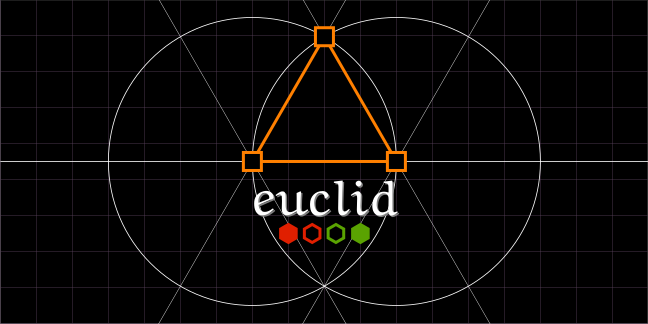
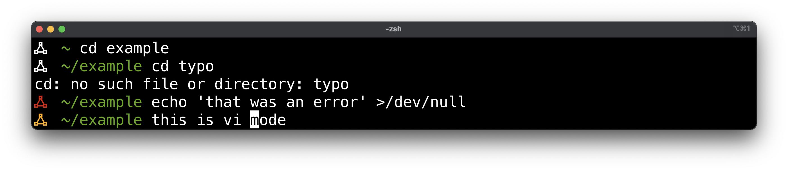
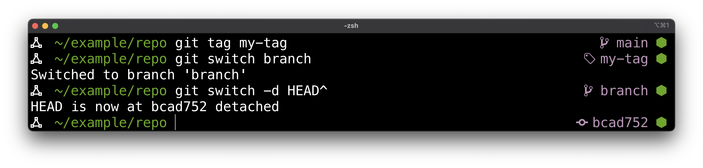
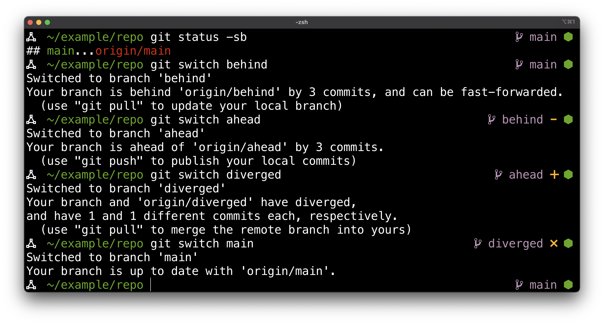
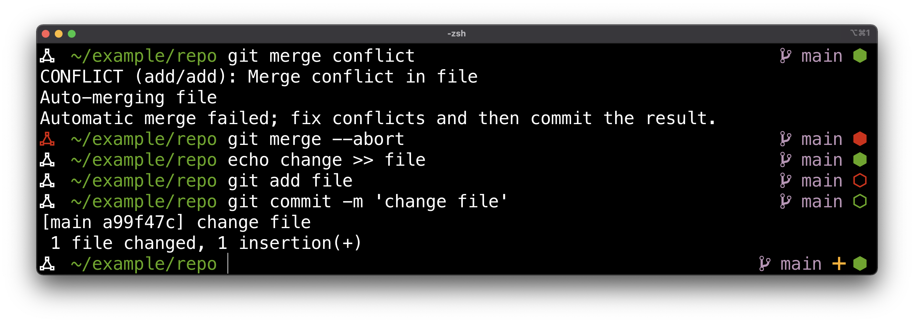
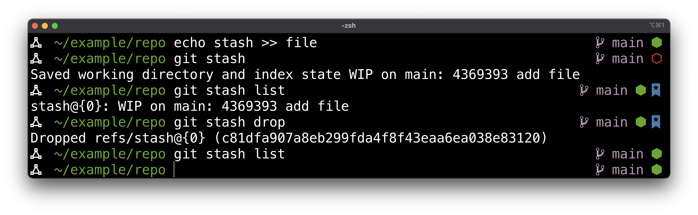

# Euclid



A minimalist zsh prompt inspired by [geometry](https://github.com/geometry-zsh/geometry).

**Features**
* powered by [gitstatus](https://github.com/romkatv/gitstatus)
* uses [nerd font](https://www.nerdfonts.com) icons
* flexible api for easy extension & customization
* information dense prompts through careful use of colors & icons

## Installation

For icon support, install one of the [Nerd Fonts](https://www.nerdfonts.com/). You could also just customize the icons if you prefer something friendlier to your font.

Manually install by cloning this repo with its submodules and sourcing the plugin:

```console
$ git clone --recurse-submodules https://github.com/ajvondrak/euclid
$ source euclid/euclid.zsh
```

You could also use your [plugin manager of choice](https://gist.github.com/olets/06009589d7887617e061481e22cf5a4a).

## Documentation

* 🎨 [**Settings**](doc/settings.md)

  How to configure Euclid's default prompts and builtin elements

* 🏛 [**Architecture**](doc/architecture.md)

  The overall design of Euclid, in case you want to customize it even further

## Screenshots

The screenshots below were made using an [iTerm2](https://iterm2.com/) window with the builtin [Tango Dark](https://github.com/mbadolato/iTerm2-Color-Schemes#builtin-tango-dark) color presets. The main font is [Menlo](https://en.wikipedia.org/wiki/Menlo_%28typeface%29), while the icons use the [SauceCodePro Nerd Font](https://github.com/ryanoasis/nerd-fonts/tree/master/patched-fonts/SourceCodePro).






